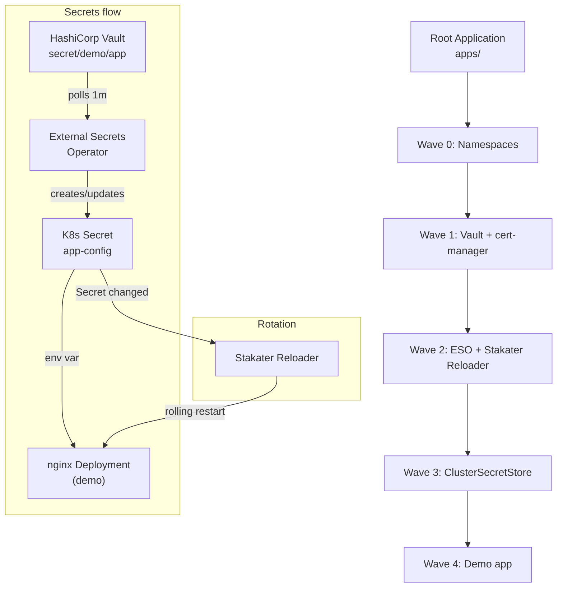

# NovaDeploy GitOps Platform

GitOps deployment platform using the **App-of-Apps** pattern. ArgoCD syncs desired state from this repo; a single root Application deploys all platform components in dependency order via sync waves.

## Tools

| Tool | Purpose |
|------|--------|
| **ArgoCD** | GitOps controller; reconciles cluster from Git |
| **HashiCorp Vault** | Secret store (dev mode); holds app secrets |
| **External Secrets Operator (ESO)** | Syncs secrets from Vault into Kubernetes Secrets |
| **cert-manager** | TLS certificates; used by ESO webhook |
| **Stakater Reloader** | Restarts workloads when ConfigMaps/Secrets change |

## App-of-Apps

The root Application points at the `apps/` directory. ArgoCD applies every manifest in `apps/` (except `root.yaml`), creating child Applications and other resources. Sync waves enforce order:

- **Wave 0** — Namespaces
- **Wave 1** — Vault, cert-manager
- **Wave 2** — External Secrets Operator, Stakater Reloader
- **Wave 3** — ClusterSecretStore (ESO → Vault)
- **Wave 4** — Demo app (nginx + ExternalSecret)

### Health-based blocking (recommended)

Argo CD **waits for each wave to become Healthy** before applying the next wave — but only for resource kinds that have a health check defined. To prevent the "secret not there" failure (apps starting before the K8s Secret exists), configure custom health checks so that:

- **ClusterSecretStore** is Healthy only when the store is validated (Ready).
- **ExternalSecret** is Healthy only when the Secret has been synced (Ready).
- **Application** (child apps) is Healthy when its sync and resources are healthy, so the root app waits for e.g. vault-secret-store before creating the demo app.

Apply the provided ConfigMap once to the cluster where Argo CD runs, then restart the application controller:

```bash
kubectl apply -f platform/argocd/argocd-cm-health.yaml
kubectl rollout restart deployment argocd-application-controller -n argocd
```

After that, sync waves will not proceed until resources in the current wave are Healthy. If the ExternalSecret is Degraded (e.g. Vault not seeded), the demo app wave will not apply until it is fixed.

---

## Design Document

### Architecture Overview



### Deployment Safety Strategy

How this platform prevents the four incidents described in the assignment:

| Incident | How we prevent it |
|----------|-------------------|
| **Secret not there (CrashLoopBackOff)** | Sync waves plus **health checks** (see `platform/argocd/argocd-cm-health.yaml`): Argo CD waits for ClusterSecretStore and ExternalSecret to be Healthy before applying Postgres and the app. The app wave does not apply until the K8s Secret exists. |
| **CRD race (no matches for kind)** | cert-manager and ESO install their CRDs in wave 1–2. ClusterSecretStore (wave 3) and demo ExternalSecret (wave 4) apply only after ESO CRDs exist. |
| **Phantom edit reverted** | Root Application has `selfHeal: true`; ArgoCD continuously reconciles from Git and reverts any `kubectl edit` back to the desired state. |
| **Shared secret blast radius** | Each service uses its own ExternalSecret pointing at distinct Vault paths (or keys). Stakater Reloader restarts only workloads annotated with `reloader.stakater.com/auto: "true"` when their referenced Secret changes. |

### Incident Runbook: "Secrets not syncing"

**Symptoms:** Demo pod in `CreateContainerConfigError` or `ImagePullBackOff` (wrong cause); ESO ExternalSecret shows `SecretSyncedError` or `ClusterSecretStoreNotFound`.

**Check:**
1. `kubectl get clustersecretstore vault` — is it `Ready`?
2. `kubectl get secret vault-token -n external-secrets` — does it exist? (Create if missing; see "After sync" below.)
3. `kubectl get externalsecret -n demo` — status/conditions; is the secret present in Vault? (`kubectl exec -n vault vault-0 -- vault kv get secret/demo/app`)
4. ESO logs: `kubectl logs -n external-secrets -l app.kubernetes.io/name=external-secrets`

**Likely causes:** Missing `vault-token` Secret; Vault unreachable; secret path wrong in ExternalSecret; Vault not seeded.

**Remediation:** Create `vault-token`; seed Vault (see "Seed Vault" section); fix ExternalSecret `remoteRef.key` if path is wrong; restart ESO pods if needed.

## Bootstrap

With ArgoCD already installed and this repo connected:

1. **Enable health-based blocking (recommended)** so waves wait for Healthy before proceeding:
   ```bash
   kubectl apply -f platform/argocd/argocd-cm-health.yaml
   kubectl rollout restart deployment argocd-application-controller -n argocd
   ```
2. **Deploy the platform:**
   ```bash
   kubectl apply -f apps/root.yaml
   ```

ArgoCD will sync the root app and then all child apps in wave order. With the health ConfigMap applied, it will not start the next wave until the current one is Healthy.

---

## After sync: create Vault token secret (ESO)

The **vault-secret-store** application deploys a `ClusterSecretStore` that connects ESO to Vault. It expects a Kubernetes Secret named `vault-token` in the `external-secrets` namespace. Create it once (Vault dev mode uses the root token `root`):

```bash
kubectl create secret generic vault-token --from-literal=token=root -n external-secrets --dry-run=client -o yaml | kubectl apply -f -
```

If you see *"cannot get Kubernetes secret \"vault-token\" from namespace \"external-secrets\": secrets \"vault-token\" not found"* in the vault-secret-store app, run the command above; ESO will then be able to use the ClusterSecretStore.

---

## Seed Vault for demo app (no secrets in Git)

**Important:** ArgoCD will happily create the demo app **before** Vault is seeded, but the first few syncs will fail with `SecretSyncedError` until Vault contains the expected data. The safest sequence is:

1. Let ArgoCD deploy all platform components (namespaces, Vault, cert-manager, ESO, Stakater, ClusterSecretStore).
2. Create the `vault-token` Secret as shown above.
3. Seed Vault for the demo app at the paths your `ExternalSecret` expects.
4. If the demo app previously hit its sync retry limit, manually trigger a new sync for `demo-dev` in the ArgoCD UI (Refresh → Sync) once Vault is ready.

The demo app uses **per-environment** Vault paths:

- Dev: `secret/data/dev/app`

Each path must contain keys `appname`, `db_host`, `db_user`, and `db_password`. Seed them with a `kubectl exec` command — the values stay on your machine, not in Git.

The HashiCorp Vault Helm chart runs Vault as a **StatefulSet** (pod `vault-0`). Use:

```bash
kubectl exec -n vault vault-0 -- \
  vault kv put secret/dev/app \
    appname=novadeploy \
    db_host=postgres \
    db_user=api \
    db_password=devpassword
```

If your install uses a Deployment instead of a StatefulSet, replace `vault-0` with `deploy/vault`.


## Test secret rotation

End-to-end flow: rotate a secret in Vault → ESO syncs to K8s Secret (within 1m) → Stakater Reloader restarts the Deployment → new pod receives updated env vars.

**1. Before rotation** — pod env shows initial values:

```bash
kubectl exec -n demo deploy/nginx-demo -- env | grep -E "APP_NAME|DB_HOST|DB_USER"
```

Output:
```
APP_NAME=novadeploytemp
DB_HOST=postgres
DB_USER=apitemp
```

**2. Rotate in Vault (example):**

```bash
kubectl exec -n vault vault-0 -- \
  vault kv put secret/dev/app \
    appname=novadeploy \
    db_host=postgres \
    db_user=api \
    db_password=devpassword
```

**3. After rotation** — wait up to 1 minute for ESO refresh, then Reloader restarts the deployment. New pod has updated values:

```bash
kubectl exec -n demo deploy/nginx-demo -- env | grep -E "APP_NAME|DB_HOST|DB_USER"
```

Output:
```
APP_NAME=novadeploy
DB_HOST=postgres
DB_USER=api
```

`STAKATER_APP_CONFIG_SECRET` is an env var added by Stakater Reloader (hash of the watched Secret); it changes when the Secret updates.

---

## CI policy enforcement

Deployment standards are enforced automatically in **GitHub Actions**, not just via code review:

- Workflow: `.github/workflows/policy-check.yml`
- Tool: `kube-linter` with repo-local config `.kube-linter.yaml`

On every push and pull request to `main`, kube-linter runs against all manifests under `platform/` and `apps/` and fails the build if it detects:

- Containers running as root (missing `runAsNonRoot` / using UID 0)
- Images with no tag or using `:latest`
- Pods without CPU/memory requests and limits
- Pods using `hostNetwork` or `hostPID`

New standards are rolled out by first adding rules in warning-only mode (non-blocking), fixing existing workloads, and then making the workflow a required status check for the `main` branch so that misconfigurations cannot be merged.

---

## Python demo app (FastAPI + Postgres)

To build the local image used by the migration Job and Deployment:

```bash
docker build -t novadeploy/python-app:latest ./docker_python_app
```

Because this runs on Docker Desktop, Kubernetes can use the locally built image with `imagePullPolicy: Never`.
