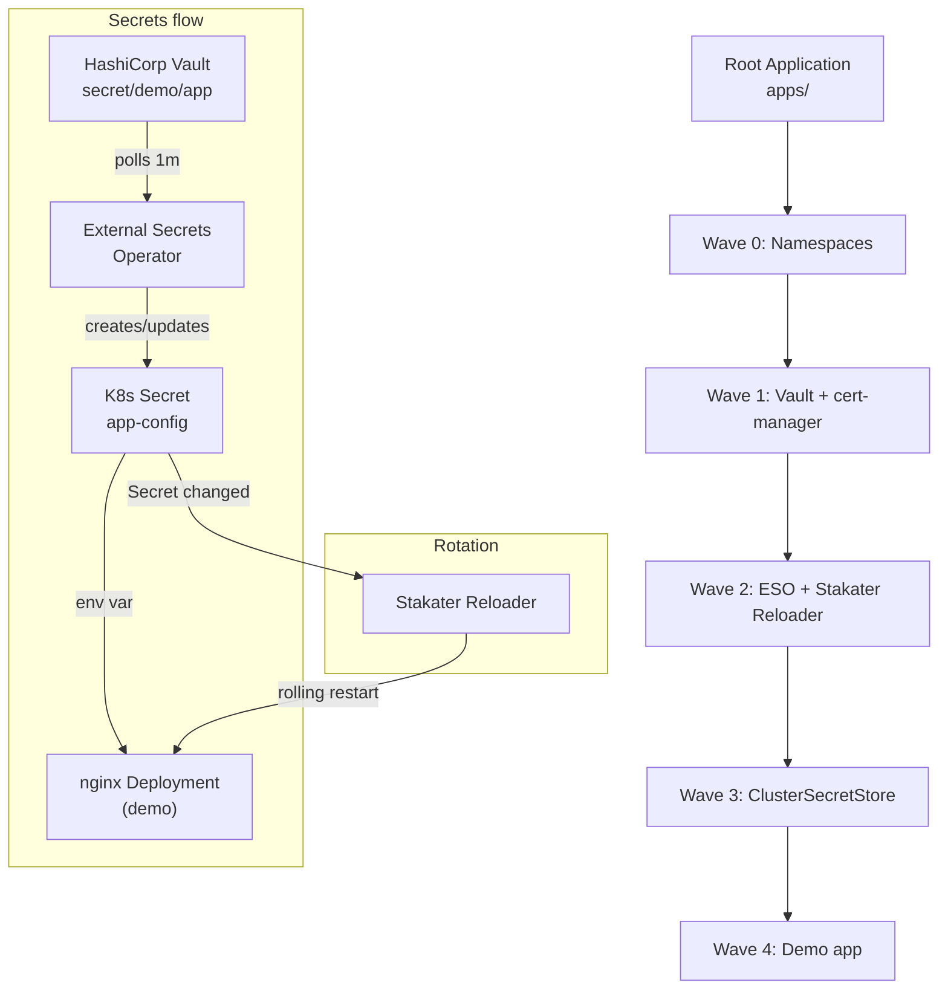

# NovaDeploy GitOps Platform

GitOps deployment platform using the **App-of-Apps** pattern. ArgoCD syncs desired state from this repo; a single root Application deploys all platform components in dependency order via sync waves.

## Tools

| Tool | Purpose |
|------|--------|
| **ArgoCD** | GitOps controller; reconciles cluster from Git |
| **HashiCorp Vault** | Secret store (dev mode); holds app secrets |
| **External Secrets Operator (ESO)** | Syncs secrets from Vault into Kubernetes Secrets |
| **cert-manager** | TLS certificates; used by ESO webhook |
| **Stakater Reloader** | Restarts workloads when ConfigMaps/Secrets change |

## App-of-Apps

The root Application points at the `apps/` directory. ArgoCD applies every manifest in `apps/` (except `root.yaml`), creating **ApplicationSet** resources (in `apps/appsets/`) and standalone **Application** resources (`demo-dev`, `demo-prod`). Each ApplicationSet generates one Application per environment (dev, prod), targeting the respective cluster. Sync waves enforce order:

- **Wave 0** — Namespaces
- **Wave 1** — Vault, cert-manager
- **Wave 2** — External Secrets Operator, Stakater Reloader
- **Wave 3** — ClusterSecretStore (ESO → Vault)
- **Wave 4** — Demo app (nginx + ExternalSecret)

---

## Design Document

### Architecture Overview



### Deployment Safety Strategy

How this platform prevents the four incidents described in the assignment:

| Incident | How we prevent it |
|----------|-------------------|
| **Secret not there (CrashLoopBackOff)** | Platform waves ensure ESO (wave 2) and ClusterSecretStore (wave 3) exist before demo (wave 4). Inside the demo app, `ExternalSecret` is sync-wave `0` and Deployment is sync-wave `1`, so ArgoCD waits for secret sync first. |
| **CRD race (no matches for kind)** | cert-manager and ESO install their CRDs in wave 1–2. ClusterSecretStore (wave 3) and demo ExternalSecret (wave 4) apply only after ESO CRDs exist. |
| **Phantom edit reverted** | Root Application has `selfHeal: true`; ArgoCD continuously reconciles from Git and reverts any `kubectl edit` back to the desired state. |
| **Shared secret blast radius** | Each service uses its own ExternalSecret pointing at distinct Vault paths (or keys). Stakater Reloader restarts only workloads annotated with `reloader.stakater.com/auto: "true"` when their referenced Secret changes. |

**What "healthy" means:**
- `Deployment`: desired replicas become Ready.
- `CRD`: API is registered; CR consumers are applied only in later waves.
- `ExternalSecret`: ESO reports `Ready=True` and target secret exists.
- `ClusterSecretStore`: ESO reports `Ready=True`.
- Helm-based operator apps: underlying Deployments/StatefulSets are Ready.

**If a phase is slow or partially succeeds:**
- ArgoCD marks the application as `Progressing`/`Degraded` and does not advance dependent waves.
- Child applications use retry backoff (`limit: 5`, exponential backoff) for transient failures.
- `CreateNamespace=true` prevents downstream failures caused only by missing namespaces.

### Incident Runbook: "Secrets not syncing"

**Symptoms:** Demo pod in `CreateContainerConfigError` or `ImagePullBackOff` (wrong cause); ESO ExternalSecret shows `SecretSyncedError` or `ClusterSecretStoreNotFound`.

**Check:**
1. `kubectl get clustersecretstore vault` — is it `Ready`?
2. `kubectl get secret vault-token -n external-secrets` — does it exist? (Create if missing; see "After sync" below.)
3. `kubectl get externalsecret -n demo` — status/conditions; is the secret present in Vault? (`kubectl exec -n vault vault-0 -- vault kv get secret/demo/app`)
4. ESO logs: `kubectl logs -n external-secrets -l app.kubernetes.io/name=external-secrets`

**Likely causes:** Missing `vault-token` Secret; Vault unreachable; secret path wrong in ExternalSecret; Vault not seeded.

**Remediation:** Create `vault-token`; seed Vault (see "Seed Vault" section); fix ExternalSecret `remoteRef.key` if path is wrong; restart ESO pods if needed.

## Bootstrap

With ArgoCD already installed and this repo connected, deploy the full platform with:

```bash
kubectl apply -f apps/root.yaml
```

ArgoCD will sync the root app and then all child apps in wave order.

---

## After sync: create Vault token secret (ESO)

The **vault-secret-store** application deploys a `ClusterSecretStore` that connects ESO to Vault. It expects a Kubernetes Secret named `vault-token` in the `external-secrets` namespace. Create it once (Vault dev mode uses the root token `root`):

```bash
kubectl create secret generic vault-token --from-literal=token=root -n external-secrets --dry-run=client -o yaml | kubectl apply -f -
```

If you see *"cannot get Kubernetes secret \"vault-token\" from namespace \"external-secrets\": secrets \"vault-token\" not found"* in the vault-secret-store app, run the command above; ESO will then be able to use the ClusterSecretStore.

---

## Seed Vault for demo app (no secrets in Git)

The demo app uses **per-environment** Vault paths:

- Dev: `secret/data/dev/app`
- Prod: `secret/data/prod/app`

Each path must contain keys `appname`, `db_host`, and `db_user`. Seed them with a `kubectl exec` command — the values stay on your machine, not in Git.

The HashiCorp Vault Helm chart runs Vault as a **StatefulSet** (pod `vault-0`). Use:

```bash
# Dev environment
kubectl exec -n vault vault-0 -- \
  vault kv put secret/dev/app appname=novadeploy db_host=postgres db_user=api

# Prod environment
kubectl exec -n vault vault-0 -- \
  vault kv put secret/prod/app appname=novadeploy db_host=postgres db_user=api
```

If your install uses a Deployment instead of a StatefulSet, replace `vault-0` with `deploy/vault`.


## Test secret rotation

End-to-end flow: rotate a secret in Vault → ESO syncs to K8s Secret (within 1m) → Stakater Reloader restarts the Deployment → new pod receives updated env vars.

**1. Before rotation** — pod env shows initial values:

```bash
kubectl exec -n demo deploy/nginx-demo -- env | grep -E "APP_NAME|DB_HOST|DB_USER"
```

Output:
```
APP_NAME=novadeploytemp
DB_HOST=postgres
DB_USER=apitemp
```

**2. Rotate in Vault:**

```bash
kubectl exec -n vault vault-0 -- vault kv put secret/demo/app appname=novadeploy db_host=postgres db_user=api
```

**3. After rotation** — wait up to 1 minute for ESO refresh, then Reloader restarts the deployment. New pod has updated values:

```bash
kubectl exec -n demo deploy/nginx-demo -- env | grep -E "APP_NAME|DB_HOST|DB_USER"
```

Output:
```
APP_NAME=novadeploy
DB_HOST=postgres
DB_USER=api
```

`STAKATER_APP_CONFIG_SECRET` is an env var added by Stakater Reloader (hash of the watched Secret); it changes when the Secret updates.

---

## Multi-environment management (dev vs prod)

This repo now models **two environments** — dev and prod — from a single codebase. Both clusters are driven by the same Git revision (`targetRevision: main`), but differ in operationally meaningful ways.

### Where environments live

- **ArgoCD location (hub)**: runs only on the **dev cluster**.
- **Dev cluster**:
  - Targeted via `destination.server: https://kubernetes.default.svc`.
  - Applications are generated by ApplicationSets with `env: dev` entries.
  - Demo app: `apps/demo-dev.yaml` → `platform/demo/dev`.
- **Prod cluster**:
  - Targeted via `destination.server: https://<PROD_CLUSTER_API_URL>` (from `argocd cluster list`).
  - Applications are generated by the same ApplicationSets with `env: prod` entries.
  - Demo app: `apps/demo-prod.yaml` → `platform/demo/prod`.

All shared platform components (Vault, cert-manager, ESO, Stakater Reloader, namespaces, ClusterSecretStore) are defined **once** in `apps/appsets/*.yaml` and parameterized over `env` and `server`. This avoids duplication while keeping environments separate at the cluster level.

### Dev vs prod behavior

- **Resource allocation**:
  - Dev (`platform/demo/dev/deployment.yaml`): `replicas: 1`, small CPU/memory.
  - Prod (`platform/demo/prod/deployment.yaml`): `replicas: 3`, higher CPU/memory.
- **Secret refresh / sensitivity**:
  - Dev (`platform/demo/dev/external-secret.yaml`): `refreshInterval: "30s"` for quick feedback.
  - Prod (`platform/demo/prod/external-secret.yaml`): `refreshInterval: "5m"` to reduce churn.
- **Reconciliation behavior**:
  - Dev (`apps/demo-dev.yaml`): has `syncPolicy.automated` with `prune` and `selfHeal` — every commit to `main` auto-rolls out.
  - Prod (`apps/demo-prod.yaml`): **no** `syncPolicy.automated` — changes are visible in ArgoCD but only applied when a human clicks **Sync**.

This is what “prod is more conservative than dev” concretely means in this platform.

### Promotion process (dev → prod)

With this layout, promoting a change is a Git-based flow:

1. **Develop and test on dev cluster**
   - Commit changes to manifests/Helm values.
   - Push to `main`; ArgoCD dev apps auto-sync.
   - Verify dev health: `argocd app get demo-dev`, `kubectl get pods -n demo`, functional tests.

2. **Approve for prod**
   - Review the diff ArgoCD shows for `demo-prod` and platform apps.
   - Optionally tag the commit (e.g. `v1.2.3`) to mark the release.

3. **Promote**
   - In ArgoCD UI (or CLI), select the `demo-prod` Application and platform apps and press **Sync**.
   - Because both environments read from the same Git revision, the manifests are identical except for intentional differences (replicas, resources, refresh interval, Vault path, sync policy).

### Diagnosing differences between environments

If something works in dev but fails in prod:

- Use ArgoCD diff:
  - `argocd app diff demo-dev demo-prod` — shows manifest differences between the two apps.
- Compare platform state:
  - `argocd app diff vault-dev vault-prod` (generated by the `vault` ApplicationSet).
- Check Vault and ESO:
  - Dev: `vault kv get secret/dev/app`
  - Prod: `vault kv get secret/prod/app`
  - Ensure both have the same keys/shape and ESO conditions are `Ready=True`.

Because both clusters are driven from the same Git repo and versions, any divergence you see is either:

- By **design** (prod’s higher replicas/limits, slower refresh, manual sync), or
- An actual drift/config issue surfaced by `argocd app diff` and the ESO/Vault checks above.